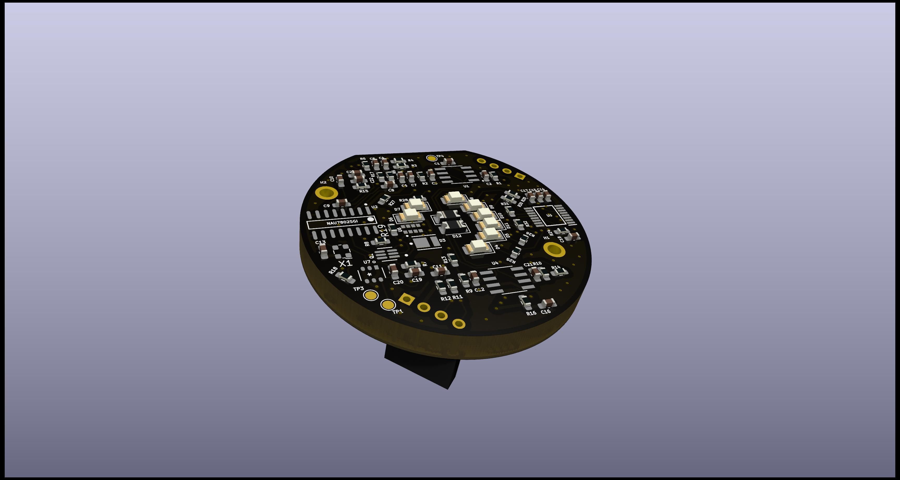
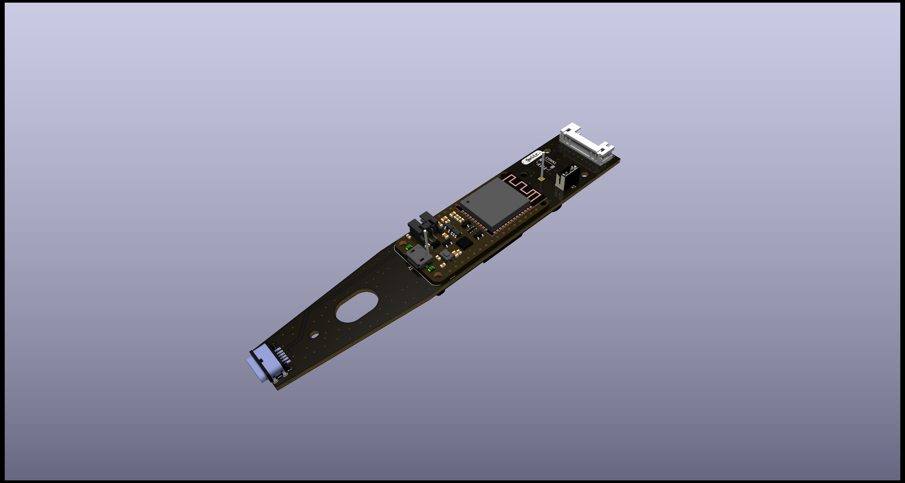

> **Warning**
> Documentation under development.

# Electronics hardware
To make the handheld scanner, the hardware is divided into two modules, connected by a JST SH4 cable following the standards of [Sparkfun's Qwiic](https://www.sparkfun.com/qwiic#faqs "Link to the SparkFun QWIIC FAQs") and [Adafruit's StemmaQT](https://learn.adafruit.com/introducing-adafruit-stemma-qt/technical-specs "Link to the Adafruit StemmaQT technical specifications"). 

The handheld scanner will contain of the following modules:
- Scanner module
- Controller module

# Scanner module
The scanner module has has all NIR LEDs, a LED controller to turn the LEDs on and off, an ADC to measure the reflectance and a color sensor to estimate the color of the speciment.

Via the Qwiic/StemmaQT connector, it´s possible to communicate with the color sensor, ADC and LED controller via I2C. The board also has holes for regular pin connections. This means that when your goal is to just perform a scan, you just need to connect any controller to the scanner module

# Controller module
The controller module is intended to control the scanner, handle data, give user feedback and provide power for the whole scanner. 
The board is designed to fit a development-board with the [Adafruit feather layout](https://learn.adafruit.com/adafruit-feather/feather-specification "Link to Sdafruits info on feather design"). 

## Why the Feather layout?
The Adafruit Feather is well specified and openly available on [Adafruit's website](https://learn.adafruit.com/adafruit-feather/feather-specification "Link to Adafruit's info on Feather design") and there is a large variety of boards being designed with the same basic pin-out. This allows other makers to choose the specific microcontroller that fits their needs. 

Feather boards have battery charging capability and management and use 3.3v logic.

Another reason to use a feather layout is to use the well-documented ESP32 board, to minimize problems with missing documentation and avoid pin-out re-arrangement when using different logic boards. 

